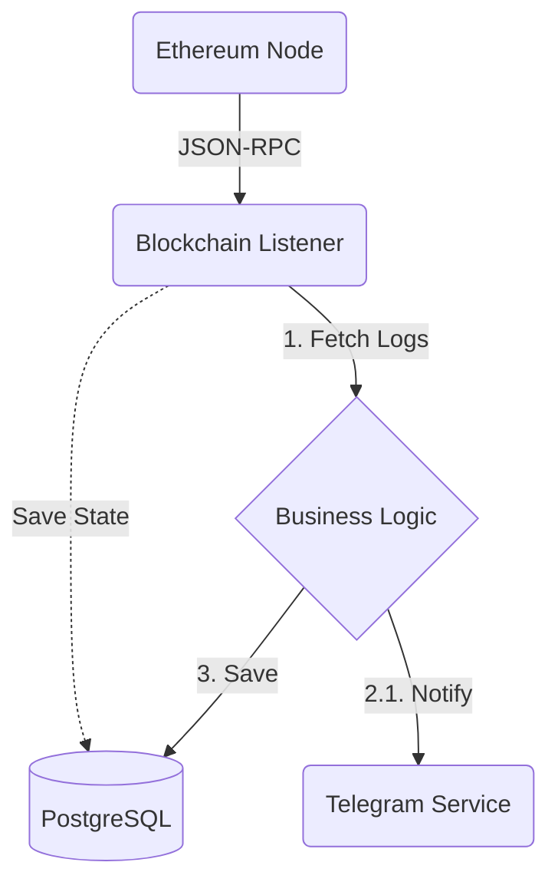

# Blockchain Whale Watcher Bot

An asynchronous, production-ready Python service that monitors the Ethereum blockchain for large stablecoin transfers ("Whale Alerts") and sends real-time notifications to Telegram subscribers.

Built with a focus on **fault tolerance**, **data integrity**, and **clean architecture**.

Architecture is blockchain-agnostic and can be easily adapted for Solana.
---

## Key Features

*   **Real-time Monitoring:** Polls the Ethereum blockchain using stateless HTTP requests.
*   **Fault Tolerance:** Persists the `last_processed_block` in the database. If the service restarts, it resumes scanning exactly where it left off, ensuring **zero data loss**.
*   **Event-Driven Architecture:** Uses an internal Event Bus to decouple blockchain listening from notification logic.
*   **Multi-user Support:** Supports multiple Telegram subscribers via a persistent database storage.
*   **Dockerized:** Fully containerized with `uv` for fast builds and `docker-compose` for orchestration.

## Tech Stack

*   **Core:** Python 3.13
*   **Blockchain:** `web3.py`, RPC (Alchemy/Ankr/DRPC)
*   **Database:** PostgreSQL, SQLAlchemy 2.0 (Async), Alembic
*   **Telegram:** `aiogram` 3.x
*   **Infrastructure:** Docker, Docker Compose
*   **Package Manager:** `uv`

## Architecture

The project follows **Domain-Driven Design (DDD)** principles with a clear separation of concerns:



## Getting Started

### Prerequisites
*   Docker & Docker Compose
*   Ethereum RPC URL (from Alchemy, Infura, or DRPC)
*   Telegram Bot Token (from @BotFather)

### Installation

1.  **Clone the repository:**
    ```bash
    git clone https://github.com/malakia3491/blockchain-whale-watcher.git
    cd blockchain-whale-watcher
    ```

2.  **Configure the environment:**
    Create a `ini.prod.conf` file based on the example structure:
    ```ini
    [Telegram]
    API_KEY = your_telegram_bot_token

    [Blockchain]
    NODE_URL = https://eth-mainnet.g.alchemy.com/v2/your_key
    TARGET_CONTRACT = 0xdAC17F958D2ee523a2206206994597C13D831ec7
    ERC_20_TRANSFER_ABI = [...]
    
    [Database]
    ASYNC_DATABASE_URL = postgresql+asyncpg://user:secret@db_postgres/whale_db
    ```

3.  **Run with Docker:**
    ```bash
    docker-compose up -d --build
    ```

The bot will automatically apply database migrations (`alembic upgrade head`) and start listening to the blockchain.
